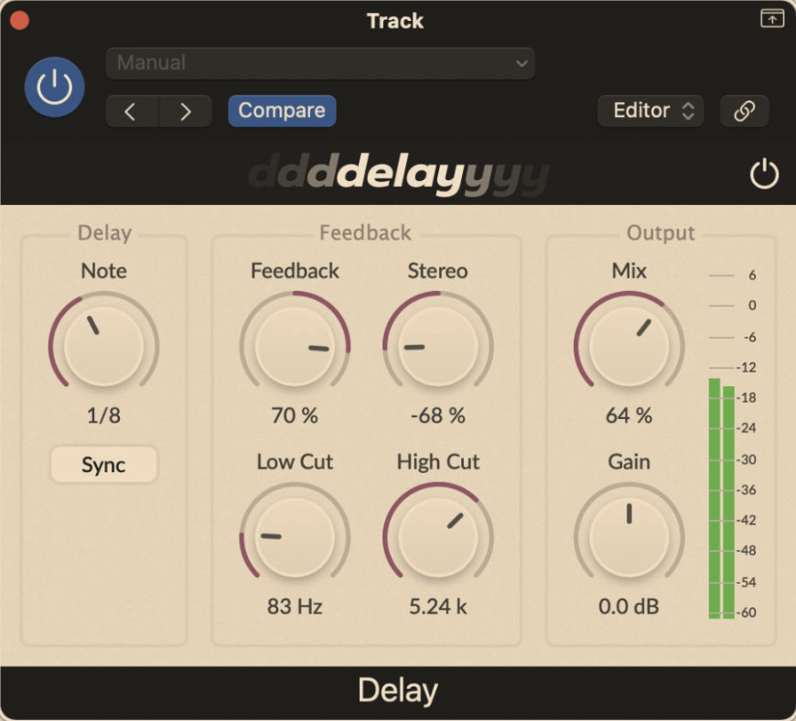

# Summary
This repository is a collection of audio effects plugins implemented from the explanations in the book *"The Complete Beginner's Guid to Audio Plug-in Development"* by Matthijs Hollemans.

The audio effects implemented are:

- [**Delay**](Delay) implements a basic delay with feedback and mix controls using a circular delay line. It uses simple linear interpolation to achieve fractional delay times.



# Clone and build
These plugins are implemented using [JUCE](https://juce.com/), which provides a framework for building audio plugins for various platforms (Windows and macOS), and in multiple formats (VST, AU, RTAS, AAX, etc.), as well as standalone applications. You can run the following commands in the terminal to clone this repository and to checkout the latest version of JUCE that was used to build all the projects:
```
git clone https://github.com/bytems/Audio-Effects.git
cd Audio-Effects/
git submodule update --init
```

# License
Code by Mohamed Saleh.
Copyright &copy; 2024 Mohamed Saleh.

This program is free software: you can redistribute it and/or modify
it under the terms of the GNU General Public License as published by
the Free Software Foundation, either version 3 of the License, or
(at your option) any later version.

This program is distributed in the hope that it will be useful,
but WITHOUT ANY WARRANTY; without even the implied warranty of
MERCHANTABILITY or FITNESS FOR A PARTICULAR PURPOSE. See the
GNU General Public License for more details.

You should have received a copy of the GNU General Public License
along with this program. If not, see <https://www.gnu.org/licenses/>.
